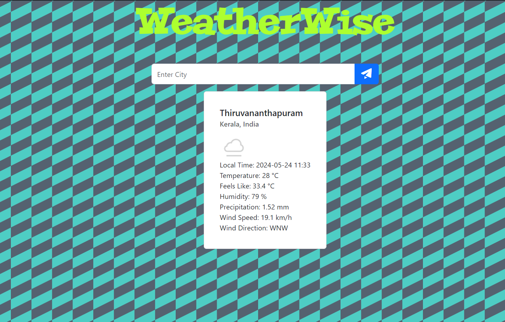

# WeatherWise

WeatherWise is a weather application hosted on your local computer. It uses weatherAPI to get up to date current weather information.

It returns you with parameters Time, Temperature, Feels Like, Humidity, Precipitation, Wind Speed and Wind Direction.



## Deployed on render

I have deployed the website on render.com

Here is the link [Weather App](https://weather-app-gb5c.onrender.com) . It might take almost 1 minute to load for the first time as I am using a free deployment plan.

## To run the code
**First install all node modules**

```
npm i
```
**Then run the server**

```
node index.js
```

## Languages and Frameworks used

1. **JavaScript** :- Used to handle server side code
2. **EJS (Embedded JavaScript)** :- Used as a HTML and JavaScript template 
3. **CSS and BootStrap** :- Used for styling and responsiveness
4. **Node.js** :- Used for importing several helpful modules like *axios* for handling APIs, *bodyParser*  and most importantly *express*
5. **Express.js** :- Used for handling server side application

## Features
* Enter the city of which you want weather information
* The API will return a JSON
* The code will extract parameters like time, temperature, wind, precipitation from the JSON
